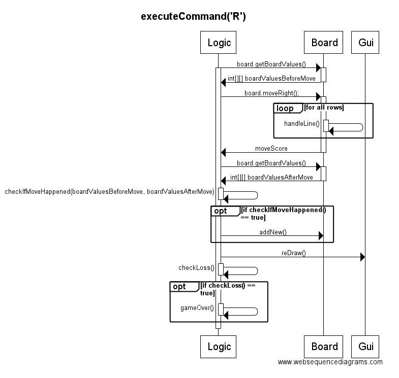

## Aihe
2048 pelin klooni. Pelissä on 4x4 alusta. Alustalla on paloja, joilla on arvo. Paloja voi yhdistää liikuttamalla palan toisen samanarvoisen palan päälle, jolloin jäljelle jäävän palan arvo tuplaantuu. Liikuttaminen tapahtuu valitsemalla liikutettava suunta, jolloin kaikki palat pelialustalla liikkuvat siihen suuntaan niin pitkälle kuin mahdollista pysähtyen tai yhdistyen loppupaikassaan riippuen palan omasta ja mahdollisen viereisen palan arvosta.
Alkuperäisen pelin tavoitteena on päästä 2048 palaan, mutta tämän version tavoitteena on saada mahdollisimman paljon pisteitä paloja yhdistelemällä.

## Käyttäjät
* Pelaaja

### Pelaajan toiminnot
* Pelin aloitus
* Pelin palojen liikuttaminen neljään eri suuntaan
* Uuden pelin aloitus kesken pelin
* Häviö, sillä peli voi päättyä vain häviöön.
* High Scoren ihailu
* Uusi peli tai pelin lopetus häviämisen jälkeen

## Luokkakaavio

## Rakenne
Pelin ydin on Logic luokassa, joka toteuttaa toiminnallisuuden pelille. Logic lue Board olion, joka on 2d-taulukko ja siihen liittyvää toiminnallisuutta. Taulukkoon sijoitetaan Piece olioita. Lisäksi on Location luokka, jonka tarkoituksena on vain antaa mahdollisuus palauttaa x, y koordinaatteja metodeista ja sitä ei käytetä esimerkiksi Piecejä liikuteltaessa.

Logicin tehtävinä on mm. komentaa Boardia (esim. lisää uusi Piece tai liikuta/yhdistä Piecejä vasemmalle) ja huolehtia pelinkulusta. Logic käyttää hyväksi ScoreWriter ja ScoreReader luokan olioita parhaan pistemäärän tallentamiseen/lukemiseen tiedostosta.

Board luokka manipuloi 2d-taulukkoaan Logicin antamien komentojen mukaan. Taulukossa on Piece-olioita. Piece lioita yhdistellään ja liikutellaan taulukossa. Board käyttää hyväkseen Location olioita valitsessaan lisättävän Piecen paikkaa.

Piece oliot ovat melko yksinkertaisia. Niillä on arvo- ja exponenttimuuttjat sekä metodi arvon tuplaamiseen kun Piece yhdistyy toisen kanssa.

Gui on käyttöliittymäluokka, joka luo käyttöliittymän eri osat. Nämä osat ovat KeyBoardListener, joka ottaa vastaan pelaajan komennot ja välittää ne Gui:lle, josta ne välittyvät Logicille, joka hallinnoi miten peli reagoi komentoon. Kaksi muuta osaa, GameBoard ja ScorePanel perivät JPanelin. GameBoard näyttää nykyisen pelitilanteen ja samalla hallinnoi miten se näytetään (värit yms.). ScorePanel näyttää tilastoja pelaajalle.

## Sekvenssikaaviot

## Projektin lisäominaisuuksia jos aika riittää
* Parhaan tuloksen tallennus (tehty)
* Vaihtoehtoiset peliasetukset: erikokoinen pelialusta ja eri alkuarvo paloilla (tehty). Tarttee oman UI:n (toiminee jos editoi esim. new Logic(5, 10, 2), mutta ruma. Pelaaja ei voi itse valita asetuksia) ja omat high scoret yms (ei toteutettu).
