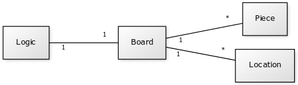

## Aihe
2048 pelin klooni. Pelissä on 4x4 alusta. Alustalla on paloja, joilla on arvo. Paloja voi yhdistää liikuttamalla palan toisen samanarvoisen palan päälle, jolloin jäljelle jäävän palan arvo tuplaantuu. Liikuttaminen tapahtuu valitsemalla liikutettava suunta, jolloin kaikki palat pelialustalla liikkuvat siihen suuntaan niin pitkälle kuin mahdollista pysähtyen tai yhdistyen loppupaikassaan riippuen palan omasta ja mahdollisen viereisen palan arvosta.
Alkuperäisen pelin tavoitteena on päästä 2048 palaan, mutta tämän version tavoitteena on saada mahdollisimman paljon pisteitä paloja yhdistelemällä.

## Käyttäjät
* Pelaaja

### Pelaajan toiminnot
* Pelin aloitus
* Pelin palojen liikuttaminen neljään eri suuntaan
* Häviö, sillä peli voi päättyä vain häviöön.

## Luokkakaavio

## Projektin lisäominaisuuksia jos aika riittää
* Parhaan tuloksen tallennus
* Vaihtoehtoiset peliasetukset: erikokoinen pelialusta ja eri alkuarvo paloilla. Tarttee oman UI:n ja omat high scoret yms.
